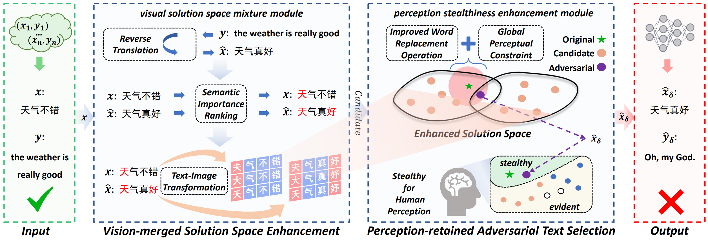

# Vision-fused Attack: Advancing Aggressive and Stealthy Adversarial Text against Neural Machine Translation

Welcome to the official implementation for the IJCAI 2024 paper *Vision-fused Attack: Advancing Aggressive and Stealthy Adversarial Text against Neural Machine Translation*.

In this paper, we proposed a vision-fused attack (VFA) framework for generating powerful adversarial text. Our VFA uses the vision-merged solution space enhancement and perception-retained adversarial text selection strategy, producing more aggressive and stealthy adversarial text against NMT models. Extensive experiments demonstrated that VFA outperforms comparisons by significant margins both in attacking ability and imperceptibility enhancements. 



## Requirements
Please configure the environment as follows:

```
conda create -n VFA python=3.8
conda activate VFA
pip install -r requirements.txt
```

## Model

Please download the following models from Huggingface:
- sentence-transformers/all-MiniLM-L6-v2
- hgl/chinese-bert-wwm-ext
- Helsinki-NLP/opus-mt-en-zh
- Helsinki-NLP/opus-mt-zh-en
- Helsinki-NLP/opus-tatoeba-en-ja
- Helsinki-NLP/opus-mt-ja-en

Then only keep the model name folder and place it in `./model/`

## Running
Please execute the following command to complete the preparation work:
```
python pixel.py
python radical.py
python TIT.py
```
Then execute the following command to obtain the adversarial texts:
```
python main.py --dataset wmt19 --device 0 --vision_constraint --percent 0.2 --thresh 0.95
```

Results will be saved in `./result/`